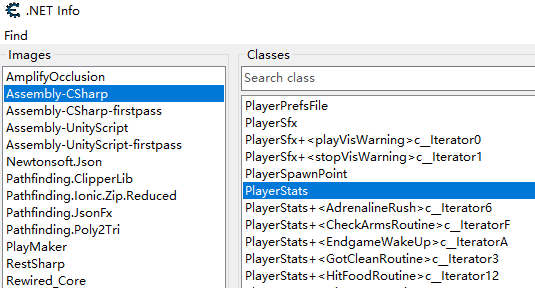
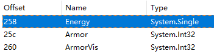

=================================
快速入门
=================================

这里以 Windows 平台的 The Forest 应用作为例子介绍 uniref 的基本用法。

新建 uniref 对象
=================================

首先从 uniref 导入 WinUniRef 类，然后指定 exe 文件名或者进程号来创建一个 WinUniRef 实例：

.. code-block:: python
    :linenos:

    from uniref import WinUniRef

    # 指定 exe 文件名
    ref = WinUniRef("TheForest.exe")

    # 指定进程号
    ref = WinUniRef(process_id=1234)

.. note::

    - 如果您指定了进程号，则会优先使用进程号作为查找进程的依据
    - 如果您指定了 exe 文件名（注意，并非进程名），请确保该 exe 文件名在所有进程中是唯一的，否则会抛出异常

类反射
=================================

查找类
------------------------

当您在 dnSpy 或 Cheat Engine 中找到了一个感兴趣的类时：

可以通过 WinUniRef 实例的 ``find_class_in_image`` 方法来获取该类的反射信息：

.. code-block:: python

    PlayerStats = ref.find_class_in_image("Assembly-CSharp", "PlayerStats")

其中第一个参数为程序集的名字，第二个参数为类的路径。如果成功找到该类，会返回一个 ``MonoClass`` 对象，否则返回 None。

对于其他有命名空间的类或者内部类也是同样的查找方式，uniref 支持解析 CE 中显示的类路径。再举一些例子：

对于上图中的三个类，您可以这样来查找：

.. code-block:: python
    :linenos:

    class_with_namespace = ref.find_class_in_image("Assembly-CSharp", "Rewired.UI.ControlMapper.Window")
    inner_class_1 = ref.find_class_in_image("Assembly-CSharp", "Rewired.UI.ControlMapper.Window+<OnEnableAsync>c__Iterator0")
    inner_class_2 = ref.find_class_in_image("Assembly-CSharp", "Rewired.UI.ControlMapper.Window+Timer")

除此之外，您也可以通过 ``find_image_by_name`` 方法首先找到程序映像，再通过 ``MonoImage`` 对象的 ``find_class`` 方法来查找类：

.. code-block:: python
    :linenos:

    image = ref.find_image_by_name("Assembly-CSharp")
    if image:
        PlayerStats = image.find_class("PlayerStats")

.. note::

    WinUniRef 中还提供了如 ``list_assemblies``, ``list_images``, ``list_classes_in_image`` 等枚举函数，方便您查找感兴趣的内容。

查找类实例
------------------------

当您需要查看/修改类中的非静态属性值或调用类中的非静态方法时，需要先找到类在内存中的实例地址。
``MonoClass`` 对象提供了 ``guess_instance_address`` 方法用于猜测内存中可能是类实例的地址。

该方法会返回一个地址列表，您可以遍历该列表，将这些地址逐一设置为类中某一属性的类实例，通过 ``.value`` 访问其值，借此筛选出满足条件的实例地址：

.. code-block:: python
    :linenos:

    addresses = PlayerStats.guess_instance_address()
    for address in addresses:
        field_energy.instance = address
        if field_energy.value == 10.0:
            print("Found")
            PlayerStats.instance = address
            break

.. note::

    如果您事先分析并找到了指向类实例的多级指针，也可以通过另一种方式来设置类实例，参考 :ref:`Goose Goose Duck`

类属性反射
=================================

查找类中的属性
------------------------

当您拿到一个 ``MonoClass`` 对象后，您可以调用 ``find_field`` 方法，通过属性名来获取类属性的反射信息：

.. code-block:: python

    Energy = PlayerStats.find_field("Energy")

如果成功找到该属性，会返回一个 ``MonoField`` 对象，否则返回 None。

当然，您也可以通过 ``find_field_by_offset`` 方法，由属性的偏移值来查找属性。例如 CE 上显示 Energy 属性的偏移值为 0x258：

于是您可以这样来书写代码：

.. code-block:: python

    Energy = PlayerStats.find_field_by_offset(0x258)

.. note:: 

    ``MonoClass`` 对象还提供了 ``list_fields`` 方法，可以将类中的所有属性以列表的形式列出。

查看与修改属性的值
------------------------

通过访问 ``MonoField`` 对象的成员 ``value`` 便可查看和修改属性的值。

.. code-block:: python

    # 获得 Energy 属性的值
    print(Energy.value)

    # 两种方式修改 Energy 属性的值
    Energy.value = 100.0
    Energy.set_value(100.0)  # 返回是否修改成功

.. note::

    对于 ``MonoField`` 对象，您可以调用 ``is_static`` 方法来判断该属性是否是静态的（被 static 关键字修饰）。
    若是静态属性，则无需设置类实例，否则需要先设置该属性所对应的类实例地址。

    .. code-block:: python

        if not Energy.is_static():
            Energy.instance = 0x12345678
        print(Energy.value)

    如果在类的级别已经设置了类实例，那么通过 ``find_field`` 得到的 ``MonoField`` 对象会自动继承该类实例，无需再次设置：

    .. code-block:: python

        PlayerStats.instance = 0x12345678

        Energy = PlayerStats.find_field("Energy")
        print(Energy.value)

类方法反射
=================================

查找类中的方法
------------------------

当您拿到一个 ``MonoClass`` 对象后，您可以调用 ``find_method`` 方法，通过方法名来获取类方法的反射信息：

.. code-block:: python

    SetCold = PlayerStats.find_method("SetCold")

如果成功找到该方法，会返回一个 ``MonoMethod`` 对象，否则返回 None。

.. note::

    ``find_method`` 方法的另一个参数为 ``param_count``，其值默认为 -1。如果同一个类中存在一个方法的不同重载，您可以首先根据参数个数来区分它们：

    .. code-block:: python

        SetCold_1 = PlayerStats.find_method("SetCold", param_count=1)
        SetCold_2 = PlayerStats.find_method("SetCold", param_count=3)

    如果有的重载参数个数也相同，您可以用方法签名来区分它们，参考 :ref:`Mirror`。

    另外， ``MonoClass`` 对象还提供了 ``list_methods`` 方法，可以将类中的所有方法以列表的形式列出。

patch 方法
------------------------

``MonoMethod`` 对象提供了 ``native_nop`` 与 ``native_patch`` 两种 patch 方式。

当您需要将 SetCold 方法偏移 0x111 处的 6 个字节修改为 nop 指令时，您可以这样编写：

.. code-block:: python

    SetCold.native_nop(0x111, 6)

``native_patch`` 的用法更加灵活，其第二个参数允许传递两种 Python 类型：

- 若是 bytes 类型，则方法的指定偏移处就会被修改为所给的字节数组
- 若是 str 类型，则会将其视作汇编代码并翻译成机器码后再进行 patch，汇编引擎为 `keystone <https://www.keystone-engine.org/>`_

.. code-block:: python

    # bytes 类型
    SetCold.native_patch(0x222, b'H\xc7\xc0\x01\x00\x00\x00')  # mov rax, 1

    # str 类型
    asm = "mov rax, 1  \n" \
          "mov rbx, 2  \n" \
          "add rax, rbx  "
    SetCold.native_patch(0x222, asm)

.. note::

    ``native_nop`` 与 ``native_patch`` 均会返回一个 ``NativePatch`` 对象，您可以用它来禁用/启用补丁：

    .. code-block:: python

        # 默认启用补丁
        patch_1 = SetCold.native_nop(0x111, 6)
        patch_2 = SetCold.native_patch(0x222, b'H\xc7\xc0\x01\x00\x00\x00')

        # 禁用补丁
        patch_1.disable()
        patch_2.disable()

        # 启用补丁
        patch_1.enable()
        patch_2.enable()

调用方法
------------------------

您可以像调用 Python 函数一样来调用 ``MonoMethod`` 对象，参数元组通过 args 来传递：

.. code-block:: python

    # 64 位应用
    SetCold(args=(1,))

    # 32 位应用需要指定函数调用约定的类型
    SetCold(args=(1,), call_type=CALL_TYPE_CDECL)

参数元组要求其中的元素均为 int 类型，目前还不支持 float / str 等类型的参数。更多关于方法调用的信息，参考 :ref:`uniref.mono.component` 的 ``MonoMethod`` 部分。

.. note::

    对于 ``MonoMethod`` 对象，您可以调用 ``is_static`` 方法来判断该方法是否是静态的（被 static 关键字修饰）。
    若是静态方法，则无需设置类实例，否则需要先设置该方法所对应的类实例地址。

    .. code-block:: python

        if not SetCold.is_static():
            SetCold.instance = 0x12345678
        SetCold(args=(1,))

    如果在类的级别已经设置了类实例，那么通过 ``find_method`` 得到的 ``MonoMethod`` 对象会自动继承该类实例，无需再次设置：

    .. code-block:: python

        PlayerStats.instance = 0x12345678

        SetCold = PlayerStats.find_method("SetCold")
        SetCold(args=(1,))

更多内容请参考 :ref:`代码示例` 与 :ref:`模块文档` 部分。
